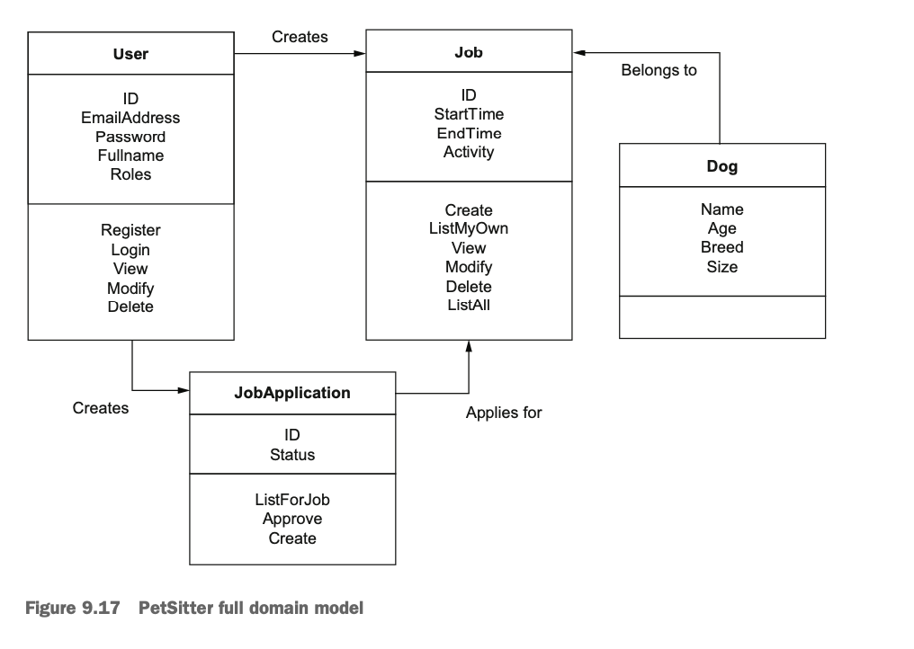

# Designing a web application

## 개요

바쁜 주인을 대신에 애완동물을 돌봐줄 사람을 찾는 서비스

## 기능

- Sign up : as a dog owner or dog walker.
- Dog owners can post jobs.
- Dog walkers can apply for posted jobs.

## Additional requirements

- Build web app with in-house team - two people
- Mobile app - work with other development agency (later!)
- Change to experiment with new technology.
- Release first working prototype as soon as possible.

| Type          | Requirement                                             | in plan? |
|---------------|---------------------------------------------------------|----------|
| Functional    | Sign up: as a dog owner ro dog walker.                  |          |
| Functional    | Dog owners can post jobs.                               |          |
| NonFunctional | Dog walkers can apply for posted jobs.                  |          |
| NonFunctional | Build web app with in-house team - two people.          | yes      |
| Nonfunctional | Mobile app - work with other development agency(later!) | yes      |
| Nonfunctional | Change to experiment with new technology.               | yes      |
| Nonfunctional | Release first working prototype as soon as possible.    |          |

## domain model

### concepts in the model

- Pet owners and pet sitter use the application, so we need a *User model*.
- as pet owners pets jobs and pet sitters apply for them, we probably need a *Job model*.
- The jobs are about dogs, so we may need a *Dog model* too.

#### user model

The team collects the following attributes on their whiteboard:

- email address
- password
- full name
- user's roll : pet owner, pet sitter, or admin

#### job and dog models

brainstorm

- When is the job, and how long will it take?
- What do you want me to do? Go for a walk, look after the dog at home, or something else?
- Who is the dog? Name, age, breed, etc.?

The first two questions lead to an attribute list for jobs:

- start time
- end time
- activity

The third question leads to an attribute list for dogs:

- name
- age (in years)
- breed
- size ( in case people are not familiar with the breed)

#### user stories

* As a \<role> I can \<capability>, so that \<receive benefit>
* Given \<prerequisite>, I can \<capability>

Here are a couple of example :

- As a pet owner I can post a pet-setting job,so that I can go on holiday.
- Given that I posted a job, I can view its status.

#### collecting user stories

pet-owner role:

- **I can register a new account and choose my role, so that I can log in**
- I can log in to my account, so that I can use the marketplace.
- I can post a job on PetSitter, including.
- **I can Post a job on PetSitter, including a description of one of my dogs, so that pet sitters can apply.**
- I can see a list of jobs I have posted.
- Given that I have posted a job, I can view and modify its details.
- Given that I have posted a job, I can delete it.
- Given that I have posted a job, I can see the pet sitter that applied.
- Given that I have found a suitable candidate, I can approve them.
- I can modify my account details.
- I can delete my account.

pre-sitter role:

- **I can register a new account and choose my role, so that I can log in.**
- I can log in to my account, so that I can use the marketplace.
- I can view a list of pets that need looking after.
- **Given that I have found a job, I can apply for it.**
- I can modify my account details.
- I can delete my account.

administrator role:

- I can log in to my account, so that I can access the admin functionality.
- I can modify my account details.
- I can modify other users' account details.
- I can edit jobs that other users have posted.
- I can delete users.

| Type          | Requirement                                             | in plan? |
|---------------|---------------------------------------------------------|----------|
| Functional    | Sign up: as a dog owner ro dog walker.                  | yes      |
| Functional    | Dog owners can post jobs.                               | yes      |
| NonFunctional | Dog walkers can apply for posted jobs.                  | yes      |
| NonFunctional | Build web app with in-house team - two people.          | yes      |
| Nonfunctional | Mobile app - work with other development agency(later!) | yes      |
| Nonfunctional | Change to experiment with new technology.               | yes      |
| Nonfunctional | Release first working prototype as soon as possible.    | yes      |

#### mapping user stories (functionality and relationships)

##### I CAN  REGISTER A NEW ACCOUNT AND CHOOSE MY ROLE

> 공부를 위해서 해당 내용을 타이핑 함. 요구 사항 정의를 바탕으로 구체적인 api 를 뽑아내는 단계

This users story appears for both pet owners and pet sitters. Registration is a prerequisite to using
the application, and it's independent of any jobs. For the User model, we can derive the action "Register" from it.

##### I CAN LOG IN MY ACCOUNT

This user story appears for all three role and is also independent of any jobs. We can assume we'll have a "Login"
action in out application's User model.

##### I CAN MODIFY MY ACCOUNT DETAILS

This user story also appears for all roles, so we can add a "Modify" actions to the User model.
Although not explicitly mentioned here, we can safely assume that a user needs to retrieve and see their details first,
before making any changes.
Therefore, we can also add a "View" action to the user model.

##### I CAN DELETE MY ACCOUNT

This user story appears for both pet owners and pet sitters and add a "Delete" action to the User model.

So far, we have identified several actions for the User model, but we haven't touched Job, Dog, or any relationships
yet. Here are the User actions

- User : Register
- User : Login
- User : View
- User : Modify
- User : Delete

(생략)

- Job : Create
- Job : List my own
- Job : View
- Job : Modify
- Job : Delete
- JobApplication : List for job
- JobApplication : Approve

(생략)

